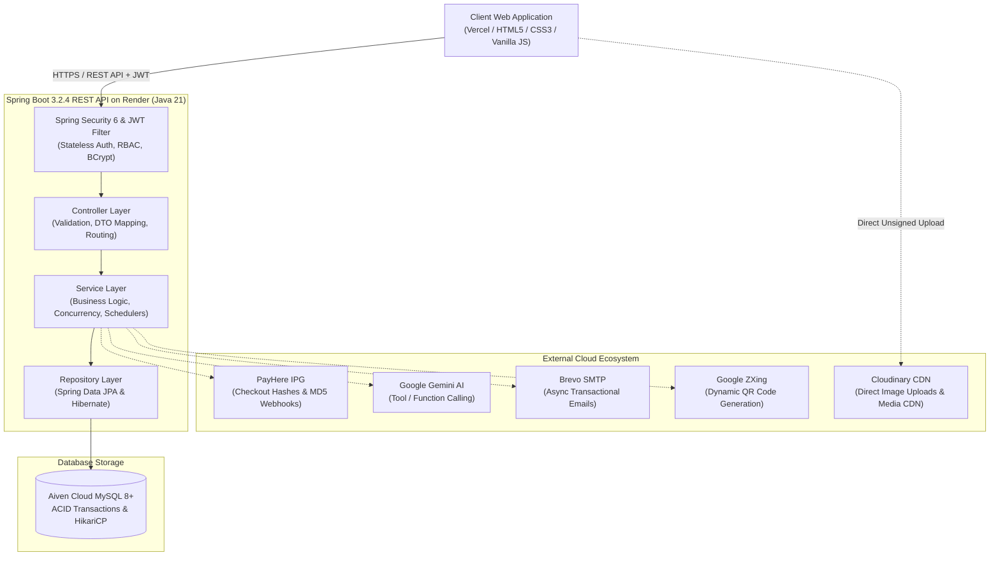

# 🎟️ EventSphere — Modern Event Discovery & Intelligent Ticketing Platform

[](https://spring.io/projects/spring-boot)
[](https://openjdk.org/projects/jdk/21/)
[](https://vercel.com/)
[](https://render.com/)
[](https://aiven.io/)
[](https://www.payhere.lk/)
[](https://ai.google.dev/)
[](https://cloudinary.com/)

**EventSphere** is a centralized, cloud-ready, and concurrent event management and ticketing platform built for **ITS 1114 – Advanced API Development** at **IJSE (Institute of Software Engineering)**.

It modernizes traditional event coordination (manual bank slip uploads, WhatsApp messaging, and spreadsheets) with an automated, concurrent booking engine, cryptographic QR gate check-ins, automated payment reconciliation, and natural language AI assistance.

---

## 🌟 Key Engineering Highlights

* 🔒 **Anti-Overselling Concurrency Control:** Database-level pessimistic write locking (`LockModeType.PESSIMISTIC_WRITE` / `SELECT ... FOR UPDATE`) prevents race conditions and overselling during simultaneous rush ticket checkouts.
* ⏱️ **10-Minute Cart Hold & Auto-Release:** Provisional ticket hold TTL managed by an automated background cron (`@Scheduled(fixedRate = 60000)`) in `BookingExpiryScheduler` that restores unpurchased inventory.
* 🛡️ **Cryptographic Anti-Tamper QR Passes:** Admission tickets signed using HMAC-SHA256 (`Base64Url(ticketCode:signature)`). Gate scanners pre-validate signatures in memory before querying the database, eliminating forgery attacks.
* 💳 **PayHere IPG & Idempotent Webhooks:** SHA-256 merchant checkout hashes combined with asynchronous server-to-server MD5 webhook callbacks (`/api/v1/payments/notify`) ensuring guaranteed, idempotent ticket confirmation.
* 📧 **Asynchronous Multi-Recipient Email Delivery:** Spring `@Async` JavaMailSender with Brevo SMTP dispatches master HTML order receipts to buyers and personalized digital passes directly to individual attendee emails.
* 🤖 **Google Gemini AI Event Concierge:** Integrated `gemini-3.5-flash-lite` conversational assistant utilizing native server-side **Function / Tool Calling** (`search_events`, `get_event_details`, `get_my_bookings`) with read-only safety guardrails.
* ☁️ **Direct Client-Side Cloudinary Uploads:** Event banners are uploaded directly from the browser to Cloudinary via unsigned presets (`eventsphere_preset`), saving server bandwidth and memory.
* 🔄 **Frontend Session Resilience:** Auto-detects expired JWT tokens client-side, purges stale browser credentials, and seamlessly re-executes public requests without breaking the UI.

---

## 🏗️ High-Level System Architecture

The platform follows a decoupled, three-tier enterprise architecture:



---

## 👥 Three-Tier User Ecosystem & Permissions (RBAC)

| Role | Target Users | Key Capabilities & Workflows |
| :--- | :--- | :--- |
| **`ROLE_USER`** | **Attendees** | <ul><li>Browse, filter, and search published events</li><li>Select ticket tiers with a 10-minute hold window</li><li>Checkout via PayHere Sandbox / Live</li><li>Receive itemized receipts and cryptographic QR passes</li><li>Chat with Gemini AI for real-time recommendations</li></ul> |
| **`ROLE_ORGANIZER`** | **Event Hosts** | <ul><li>Submit business verification applications (BRN, NIC/Passport)</li><li>Schedule and publish events with Cloudinary media banners</li><li>Configure dynamic pricing tiers (VIP, General, Early Bird)</li><li>Monitor live ticket sales, revenues, and attendee manifests</li><li>Scan and validate QR admission passes at venue gates</li></ul> |
| **`ROLE_ADMIN`** | **System Admins** | <ul><li>Review, approve, or reject organizer credentials</li><li>Manage user accounts, roles, and status (Active, Suspended)</li><li>Oversee platform categories, venues, and audit logs</li><li>Inspect platform gross revenue and analytics</li></ul> |

---

## 💻 Technology Stack Breakdown

| Layer / Domain | Technology | Purpose & Implementation Details |
| :--- | :--- | :--- |
| **Frontend Core** | **HTML5, CSS3, Vanilla JS (ES6+)** | Responsive Dark Luxe & Midnight Glass UI, glassmorphism, micro-animations. |
| **UI Components** | **Bootstrap 5.3.3 & Bootstrap Icons** | Responsive grid, interactive dropdowns, and modern iconography. |
| **Backend Framework** | **Spring Boot 3.2.4 (Java 21 LTS)** | Core REST API, IoC, transaction boundaries, asynchronous tasks. |
| **Security & Auth** | **Spring Security 6 + JJWT 0.11.5** | Stateless JWT authentication, role guards, BCrypt password hashing. |
| **Persistence & ORM**| **Spring Data JPA & Hibernate** | 15 interconnected domain entities, custom JPQL queries, HikariCP. |
| **Database** | **MySQL 8+ (Aiven Cloud)** | Relational database with ACID transactional integrity and row-level locking. |
| **Concurrency** | **Pessimistic Locking (`PESSIMISTIC_WRITE`)** | Zero overselling during simultaneous checkouts (`SELECT ... FOR UPDATE`). |
| **Payment Gateway** | **PayHere IPG** | Sandbox/Live payments with SHA-256 checkout hashes and MD5 webhook checks. |
| **Media Storage** | **Cloudinary CDN** | Direct client-side unsigned banner uploads with edge optimization. |
| **Artificial Intelligence**| **Google Gemini API (`gemini-3.5-flash-lite`)** | Natural language event assistant with server-side tool / function calling. |
| **QR Engine** | **Google ZXing 3.5.3** | Dynamic PNG QR code generation with HMAC-SHA256 signature verification. |
| **Email Service** | **Spring Mail + Brevo SMTP** | Asynchronous delivery of receipts, attendee passes, and 6-digit OTP codes. |
| **Hosting & Cloud** | **Vercel (Web) & Render (Backend)** | Serverless frontend deployment and continuous cloud backend hosting. |

---

## 📂 Frontend Application Directory

```
eventsphere_frontend/
├── index.html                   # Home page (hero search, categories, trending events, AI widget)
├── css/
│   ├── style.css                # Dark Luxe design system (tokens, colors, typography, layout)
│   ├── components.css           # Glass cards, filter bars, pill badges, ticket steppers
│   └── responsive.css           # Mobile & tablet breakpoints (clamp, flex layouts)
├── js/
│   ├── env.js                   # Runtime public config generated from .env
│   ├── api/
│   │   ├── config.js            # esFetch wrapper, JWT auto-expiry check, and 401 recovery
│   │   ├── auth.js              # Register, login, OTP verification, password reset
│   │   ├── events.js            # Public event search, organizer event management
│   │   ├── bookings.js          # Cart hold, booking creation, attendee ticket lookup
│   │   ├── payments.js          # PayHere hash checkout & status verification
│   │   └── organizer.js         # Organizer analytics, applications, attendee lists
│   └── utils/
│       ├── nav.js               # Dynamic navbar rendering (auth state, avatar, role links)
│       ├── ai-widget.js         # Google Gemini floating conversational assistant
│       ├── otp-modal.js         # 6-digit OTP modal dialog with countdown timer
│       ├── toast.js             # Toast notifications (success, error, warning)
│       └── icons.js             # SVG icon definitions (sparkles, bells, status)
├── pages/
│   ├── events.html              # All events directory with comprehensive filter bar
│   ├── event-details.html       # Event details, Cloudinary hero, seat availability
│   ├── booking.html             # Quantity stepper, 10-min hold timer, PayHere checkout
│   ├── ticket.html              # Digital admission pass, dynamic QR code, print view
│   ├── my-bookings.html         # Attendee booking history and ticket retrieval
│   ├── login.html               # User login with role-based dashboard redirects
│   ├── register.html            # Registration form triggering OTP modal
│   ├── organizer-apply.html     # Organizer business application (BRN, NIC verification)
│   ├── organizer-dashboard.html # Organizer portal: event sales, revenues, and controls
│   ├── create-event.html        # Event creator with Cloudinary unsigned image upload
│   ├── check-in.html            # Gate scanner verifying cryptographic QR passes
│   ├── admin-dashboard.html     # Administrator panel (approvals, users, categories, venues)
│   └── about.html               # Platform architecture, technology specs, and trust policy
├── scripts/
│   └── generate_env.py          # Python script generating js/env.js from .env safely
├── dev.bat                      # Windows one-click local development startup script
├── dev.sh                       # Linux / macOS local development startup script
├── .env.example                 # Example frontend environment variables
└── vercel.json / project.json   # Vercel project deployment configuration
```

---

## 🚀 Getting Started (Local Development)

### 1. Prerequisites
* **Python 3.8+** (to run the local static HTTP server)
* **Modern Web Browser** (Chrome, Edge, Firefox, Safari)
* **Running Backend:** EventSphere Spring Boot API running locally on `http://localhost:7080` or pointing to the cloud Render URL.

### 2. Environment Configuration
Copy the example environment configuration:
```bash
cp .env.example .env
```

Edit `.env` as required:
```properties
# Backend API Base URL
API_BASE=http://localhost:7080/api/v1
# Or Cloud Backend:
# API_BASE=https://its-1114-eventsphere-booking-platform.onrender.com/api/v1

# PayHere Checkout Gateway URL
PAYHERE_GATEWAY_URL=https://sandbox.payhere.lk/pay/checkout

# Cloudinary Direct Image Upload Settings
CLOUDINARY_CLOUD_NAME=ze21miiw
CLOUDINARY_UPLOAD_PRESET=eventsphere_preset

# Local HTTP Server Port
PORT=8000
```

### 3. Run the Frontend

#### On Windows:
Double-click `dev.bat` or run:
```cmd
dev.bat
```

#### On Linux / macOS:
```bash
chmod +x dev.sh
./dev.sh
```

The script will automatically validate `.env`, generate `js/env.js`, and start the server at **`http://127.0.0.1:8000`**.

---

## 🌐 Live Deployments

* **Frontend Web Application (Vercel):** [eventsphere-webapp](https://eventsphere-webapp.vercel.app)
* **Backend REST API (Render):** [https://its-1114-eventsphere-booking-platform.onrender.com](https://its-1114-eventsphere-booking-platform.onrender.com)
* **Cloud Database:** Hosted on Aiven MySQL with connection pooling.
* **Payment Gateway:** PayHere Merchant Portal (Sandbox / Live Mode).

---

## 🔒 Security & Privacy Practices

* **Zero Credential Exposure:** Frontend `.env` only contains browser-safe public settings. Backend secrets (JWT secret, DB password, Gemini API key, Brevo credentials) are strictly retained on Render.
* **Salted Password Encryption:** Passwords use BCrypt with a cost factor of 12.
* **Payment Isolation:** All card data entry occurs on PayHere's hosted PCI-DSS compliant interface. EventSphere never stores or handles credit card numbers.
* **Single-Use Cryptographic Tickets:** Admission QR passes transition immediately to `USED` upon gate scan with append-only audit trails to prevent reuse.

---

## 🎓 Academic Module Information

* **Course:** Final Coursework
* **Module:** ITS 1114 – Advanced API Development
* **Institution:** IJSE (Institute of Software Engineering)
* **Author:** Lasandi Salwathura
